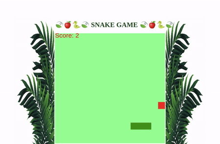

# SNAKE GAME

## Descrição do Desafio da Dio

O desadio consistiu em desenvolver de forma simples o clássico jogo da cobrinha utilizando HTML, CSS e JavaScript. 

    

Sendo assim, minha missão foi reproduzir esse projeto prático, considerando todas as instruções e dicas da expert da DIO. Nesse sentido, fiquei a vontade para implementar algumas melhorias como os folhas nas laterais usando flexbox, tranform e também o score de maçãs consumidas pela cobrinha.

O jogo pode ser acessado pelo seguinte link: https://randelsouza.github.io/snake-game/

Fique a vontade para clonar, fazer fork e implementar melhorias no código! Toda contribuição é Bem-vinda.
